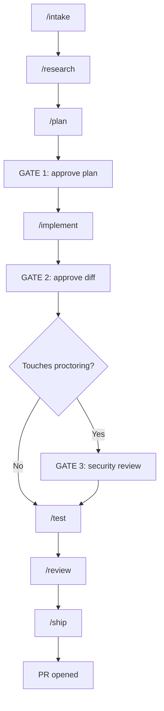

# How to Run the AI Development Workflow

**Repo:** `ZA-Assessments-Portal-FE` (AZE Student Assessment Portal)  
**Goal:** Take an AZE ticket from description to a reviewed PR — with human approval gates and Student Portal conventions enforced.

---

## Quick start (Cursor — recommended)

```text
/feature AZE-123
```

Or attach the orchestrator prompt:

```text
@.github/prompts/feature.prompt.md AZE-123
```

Reply at each gate:

| Gate | When | Reply |
|------|------|-------|
| **GATE 1** | After the plan | `approve` · `modify: <feedback>` · `reject` |
| **GATE 2** | After implementation | `continue` · `pause` · `request changes: <notes>` |
| **GATE 3** | Proctoring/security files touched | `approve` · `request changes` · `escalate` |

---

## The pipeline

```text
intake → research → plan → GATE 1
→ implement → GATE 2 → GATE 3 (if proctoring)
→ test → review → ship → PR
```



**Important:** `/implement` leaves changes **uncommitted**. Only `/ship` runs `git commit` and opens the PR.

---

## One-time setup

### 1. Project

```bash
git clone https://github.com/studyboxworld/ZA-Assessments-Portal-FE.git
cd ZA-Assessments-Portal-FE
npm install
npm run dev
```

App base path: `/student/` → `http://localhost:5173/student/`

### 2. Jira intake (Cursor)

1. Enable MCP server: `plugin-atlassian-atlassian`
2. Authenticate with your Atlassian workspace
3. Run `/intake AZE-123` or `/feature AZE-123`

**Fallback:** If MCP is unavailable, paste ticket title, description, and acceptance criteria when asked (one retry only).

### 3. PR tooling

- `gh` CLI authenticated with GitHub
- Branch naming: `feat/AZE-123`, `fix/AZE-456`

### 4. GitHub Copilot (optional)

In VS Code `settings.json`:

```json
"chat.promptFiles": true
```

Prompts live in `.github/prompts/`. See [COPILOT-README.md](COPILOT-README.md).

### 5. Claude Code (optional)

Skills live in `.claude/skills/`. See [CLAUDE-README.md](CLAUDE-README.md).

---

## Choose your tool

| Tool | Entry | Automation |
|------|-------|------------|
| **Cursor** | `/feature` or `@.github/prompts/feature.prompt.md` | Auto-chains stages + gates |
| **Claude Code** | `/feature AZE-123` in repo root | Invokes sub-skills in order |
| **GitHub Copilot** | `/intake` → `/research` → … manually | Same chat, you drive each stage |

---

## Run by scenario

### New feature (medium/large)

```text
/feature AZE-123
```

Approve GATE 1 (plan). Review diff at GATE 2. Complete GATE 3 if proctoring paths are in the plan.

### Bug fix

Run debug **before** plan:

```text
/debug Tab switch during listening test does not show strike warning
/intake AZE-456
/plan
```

Then continue through implement → test → review → ship.

### Trivial change (<50 LOC, one file)

```text
/feature "fix typo on consent screen button label"
```

Orchestrator may skip research/plan/review; GATE 1 and GATE 2 may still apply for non-trivial work.

### Refactor only (no behavior change)

```text
/refactor
```

Or: intake → research → plan → GATE 1 → implement → manual QA → ship.

### Single stage (you control the rest)

| Need | Cursor command | Rule / prompt |
|------|----------------|---------------|
| Structure a ticket | `/intake AZE-123` | `workflow-intake` |
| Explore codebase | `/research` | `workflow-research` |
| Write plan | `/plan` | `workflow-plan` |
| Write code | `/implement` | `workflow-implement` |
| Manual QA + build | `/test` | `workflow-test` |
| Review diff | `/review` | `workflow-review` |
| Commit + PR | `/ship` | `workflow-ship` |

Activate a Cursor rule by typing `/plan`, `/ship`, etc., or attach `@.cursor/rules/workflow-plan.mdc`.

---

## Size-based routing

| Size | Typical stages | Gates |
|------|----------------|-------|
| **trivial** | intake → implement → ship | GATE 3 if proctoring |
| **small** | intake → research → plan → implement → test → ship | GATE 1, 2, 3 if proctoring |
| **medium** | All 7 stages | GATE 1, 2, 3 if proctoring |
| **large** | All 7; plan splits PR if >500 LOC | GATE 1, 2, 3 if proctoring |

---

## GATE 3 — Proctoring / security

**Mandatory** when the plan or diff touches:

```text
src/context/ProctoringContext*
src/context/WebRTCProctoringContext*
src/services/test-session-security/**
src/components/test-session-security/**
docs/test-session-security-and-proctoring-integration.md
```

**Before approving GATE 3**, read:

[docs/test-session-security-and-proctoring-integration.md](docs/test-session-security-and-proctoring-integration.md)

Do not approve proctoring changes unless the ticket explicitly requires them.

---

## Before every PR (`/ship`)

### Automated (agent runs)

```bash
npm run lint
npm run build
```

Tests: `N/A — E2E not configured` (manual browser QA required).

### Manual QA (you verify in browser)

Run sections that match your change:

| Area | Check |
|------|-------|
| **Auth** | Google/Apple/FB login, session persist, logout |
| **Assessment** | Start test → consent → timer → submit → results |
| **Proctoring** | Fullscreen, tab-switch strike, terminate flow |
| **Audio** | Mic permission, RecordRTC record/playback |
| **FCM** | Notification permission, service worker |
| **Payments** | Success/failure redirect paths |

At **GATE 2**, review the diff yourself:

```bash
git diff origin/main
```

For **medium/large** changes, run `/review` in a **new Cursor chat** (fresh context, less bias).

---

## Copilot: manual sequence

Copilot does **not** auto-chain. In one chat session, run in order:

```text
/intake     AZE-123
/research
/plan
            ── GATE 1: approve ──
/implement
            ── GATE 2: continue ──
            ── GATE 3: if proctoring ──
/test
/review
/ship
```

---

## Claude Code: full pipeline

```bash
/feature AZE-123
/feature "improve assessment timer on consent screen"
```

Individual skills: `/intake`, `/research`, `/plan`, `/implement`, `/test`, `/review`, `/ship`, `/debug`, `/refactor`.

---

## Tips for effective runs

1. **Start with full ticket context** — Jira via MCP or paste AC; never a bare ticket ID alone.
2. **Read the plan at GATE 1** — Confirm `file:line` refs, failure-mode table, and `requires_gate3`.
3. **Inspect the diff at GATE 2** — Don't auto-approve without looking.
4. **One ticket per session** — Avoid mixing unrelated work.
5. **Proctoring is sacred** — Reject diffs that touch security files without ticket scope.
6. **Only `/ship` commits** — If the agent commits early, ask it to reset and follow workflow.
7. **Use domain docs** when touching specialized areas (see table below).

---

## Domain rules (Cursor auto-attaches by file glob)

| Rule | When it applies |
|------|-----------------|
| `proctoring-security.mdc` | ProctoringContext, test-session-security |
| `assessment-flows.mdc` | Adaptive section components (reading, listening, etc.) |
| `audio-recording.mdc` | Speaking/listening + RecordRTC/WaveSurfer |
| `fcm-notifications.mdc` | Firebase, notification hooks |
| `exam-timer-connectivity.mdc` | Exam timer pause/offline/resync |

---

## Hard rules (always)

- **JavaScript/JSX only** — no TypeScript
- **Imports:** `@/` alias → `src/`
- **API:** all calls through `src/api/`
- **Toasts:** Sonner only
- **New forms:** react-hook-form + Yup (not new Formik)
- **Never modify** `initDragGuard()` in `src/main.jsx`
- **Never modify** proctoring/security without explicit ticket + GATE 3
- **Commits:** Conventional Commits — `feat(AZE-123): description`

---

## Related docs

| Doc | Purpose |
|-----|---------|
| [docs/ai-workflow-setup.md](docs/ai-workflow-setup.md) | MCP and tool setup |
| [docs/ai-workflow-sync-checklist.md](docs/ai-workflow-sync-checklist.md) | Keep Cursor / Claude / Copilot in sync |
| [CLAUDE-README.md](CLAUDE-README.md) | Claude Code skills |
| [COPILOT-README.md](COPILOT-README.md) | Copilot prompt files |
| [.cursor/rules/workflow.mdc](.cursor/rules/workflow.mdc) | Cursor workflow index |
| [AGENTS.md](AGENTS.md) | Stack and conventions for all AI tools |
| [.github/PULL_REQUEST_TEMPLATE.md](.github/PULL_REQUEST_TEMPLATE.md) | PR body template used by `/ship` |

---

## Do not

- Commit during `/implement`
- Skip GATE 1 or GATE 2 on non-trivial work
- Skip GATE 3 when proctoring paths are touched
- Use Admin Panel patterns (this is the **Student** portal)
- Infer acceptance criteria from a ticket key alone
- Force-push branches
