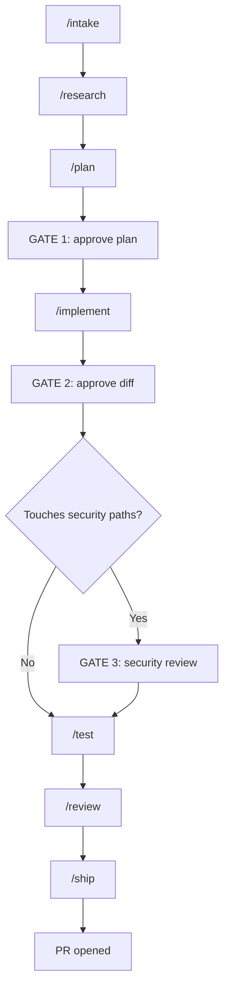

# AI Development Workflow

A portable, 7-stage AI development pipeline (`intake` → `research` → `plan` → `implement` → `test` → `review` → `ship`) designed to drive feature implementation and bugfixes from ticket description to reviewed PR, with built-in human approval gates.

---

## Quick start

### In Cursor / Claude Code / Antigravity

```text
/feature PROJ-123
```

Or invoke the master orchestrator prompt:

```text
@.github/prompts/feature.prompt.md PROJ-123
```

Reply at each gate during execution:

| Gate | When | Reply options |
|------|------|---------------|
| **GATE 1** | After plan generation | `approve` · `modify: <feedback>` · `reject` |
| **GATE 2** | After implementation | `continue` · `pause` · `request changes: <notes>` |
| **GATE 3** | Sensitive paths touched (if configured) | `approve` · `request changes` · `escalate` |

---

## Installation & Setup

### 1. Copy workflows into your repository

From `ai-dev-toolkit` (or after `npx ai-dev-toolkit`):

```bash
cp -R workflows/.github .github/          # merge prompts + issue templates
cp -R workflows/.claude .claude/          # merge skills
cp workflows/HOWTO-AI-WORKFLOW.md ./docs/ # or project root
cp workflows/reference.md ./              # customize next
```

### 2. Customize `reference.md`

Before running your first workflow, customize `reference.md` for your codebase. Paste the **Plan-mode customization prompt** (found in the root [`README.md`](../README.md#workflows)) into your AI IDE to inspect your repository and populate `reference.md` with accurate paths, stack details, and test commands.

### 3. PR tooling

- Ensure `gh` CLI is installed and authenticated (`gh auth status`) for PR creation during `/ship`.
- Check that branch naming conventions match `reference.md` (e.g. `feat/{TICKET-ID}-{desc}`).

---

## The Pipeline

```text
intake → research → plan → GATE 1
→ implement → GATE 2 → GATE 3 (optional security review)
→ test → review → ship → PR
```



> **Important:** `/implement` leaves code changes **uncommitted**. Only `/ship` creates git commits and opens the PR.

---

## Choose your AI Tool

| Tool | Entry Command | Behavior |
|------|---------------|----------|
| **Claude Code** | `/feature PROJ-123` | Master orchestrator skill chains stages & pauses at gates |
| **Cursor** | `/feature PROJ-123` or `@.github/prompts/feature.prompt.md` | Auto-chains stage prompts & pauses at gates |
| **GitHub Copilot** | `/intake` → `/research` → `/plan` … | Run prompts sequentially in chat, responding to gates |
| **Antigravity** | `/feature PROJ-123` | Invokes workflow skills from `.claude/skills/` |

---

## Workflow Scenarios

### New Feature (Medium / Large)

```text
/feature PROJ-123
```

1. Stage 1: `intake` resolves ticket title, description, and acceptance criteria.
2. Stage 2: `research` maps codebase files and conventions with `file:line` evidence.
3. Stage 3: `plan` produces an implementation plan with quality analysis and risk rating.
4. **GATE 1:** User reviews and approves plan.
5. Stage 4: `implement` creates branch and applies file edits.
6. **GATE 2:** User reviews uncommitted diff.
7. **GATE 3:** Security review (triggered if sensitive paths defined in `reference.md` are touched).
8. Stage 5: `test` runs QA & build verification commands.
9. Stage 6: `review` performs a fresh-context diff audit.
10. Stage 7: `ship` creates Conventional Commit and opens PR.

### Bug Fix

Run `debug` **before** planning to find the root cause:

```text
/debug "Error description or steps to reproduce"
/intake PROJ-456
/plan
```

Then proceed through `implement` → `test` → `review` → `ship`.

### Trivial Change (<50 LOC, single file)

```text
/feature "fix typo in navigation header label"
```

Size routing skips full research/plan stages for trivial changes while maintaining verification safety.

### Refactor Only (No behavior change)

```text
/refactor
```

Executes intake → research → plan → GATE 1 → implement → manual QA / verification (confirming zero behavioral changes).

---

## Stage Quick Reference

| Stage | Command | Purpose |
|-------|---------|---------|
| **Intake** | `/intake` | Structure ticket details, AC, size, and cross-team impact |
| **Research** | `/research` | Map relevant codebase files with `file:line` citations |
| **Plan** | `/plan` | Generate file-level implementation plan + quality analysis |
| **Implement** | `/implement` | Create branch & execute code changes (uncommitted) |
| **Test** | `/test` | Run test suite, build verification, and manual QA checks |
| **Review** | `/review` | Perform structured diff review (GO / NO-GO verdict) |
| **Ship** | `/ship` | Execute final QA, commit, push branch, and open PR |
| **Debug** | `/debug` | Evidence-based root-cause analysis for bug reports |
| **Refactor** | `/refactor` | Structural refactoring while preserving existing behavior |

---

## Size-Based Routing

| Size | Typical stages | Gates |
|------|----------------|-------|
| **trivial** | intake → implement → ship | GATE 3 if security paths touched |
| **small** | intake → research → plan → implement → test → ship | GATE 1, GATE 2, GATE 3 if security paths touched |
| **medium** | All 7 stages | GATE 1, GATE 2, GATE 3 if security paths touched |
| **large** | All 7 stages; plan splits PR if >500 LOC | GATE 1, GATE 2, GATE 3 if security paths touched |

---

## GATE 3 — Security Review (Optional)

Triggered automatically when the plan or diff touches sensitive paths defined under **Security gate (GATE 3)** in `reference.md`:

- Evaluates security impact against required security documentation specified in `reference.md`.
- Requires explicit user approval (`approve`, `request changes`, or `escalate`).
- Skipped automatically if no sensitive paths are touched or GATE 3 is not configured in `reference.md`.

---

## Pre-PR Verification (`/ship`)

Before opening a PR, the agent executes the QA commands specified in `reference.md`:

```bash
# Executed based on reference.md configuration:
npm run lint       # Lint command
npm run build      # Build command
npm test           # Test command (if configured)
```

Manual QA checks are performed against the **Manual QA domains** table defined in `reference.md`.

---

## Best Practices

1. **Keep `reference.md` updated** — Ensure paths, commands, and conventions match your project.
2. **Review plans at GATE 1** — Verify `file:line` citations, quality analysis, and scope before implementation.
3. **Inspect diffs at GATE 2** — Verify changes on disk before proceeding to testing and shipping.
4. **Never commit during `/implement`** — Only `/ship` creates git commits.
5. **Respect Do-not-touch rules** — Sacred files defined in `reference.md` must not be edited without explicit authorization.

---

## Hard Rules

- **Conventions:** Follow repository conventions defined in `reference.md`.
- **Commits:** Follow Conventional Commits format configured in `reference.md` (e.g. `feat({TICKET-ID}): description`).
- **Gating:** Never skip GATE 1 or GATE 2 on non-trivial tasks.
- **Safety:** Never force-push git branches.

---

## Related Files

| File | Purpose |
|------|---------|
| [`reference.md`](reference.md) | Central repository configuration reference |
| [`README.md`](README.md) | Workflows bundle overview & install instructions |
| [`.github/PULL_REQUEST_TEMPLATE.md`](.github/PULL_REQUEST_TEMPLATE.md) | Standard PR body template used by `/ship` |
